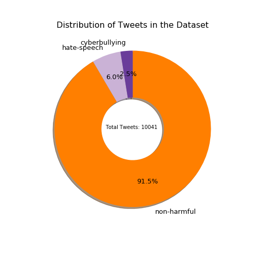
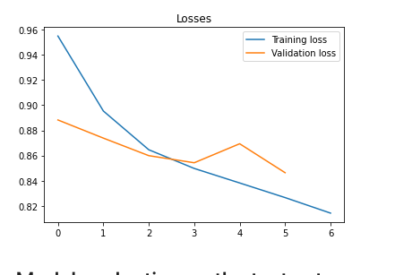
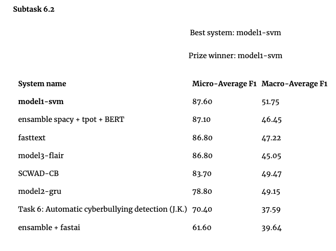

# cyberbullying-detector

## About: Automatic cyberbullying detection challenge.
* Task 6-2: Type of harmfulness http://2019.poleval.pl/index.php/tasks/task6 through Machine learning methods
* Containerization and deployment

# Machine Learning Part

* Notebooks:
  * [main.ipynb](main.ipynb) main notebook used for training
  * [test.ipynb](test.ipynb) notebook with the evalution file which includes the performance test:
    * 74 milliseconds per observation (excluding model loading time)
    * metric evaluation
* .py files
  * [model.py](model.py) CNN model files
  * [utils.py](utils.py)  miscellaneous utility functions
  * [ polishbert.py](polishbert.py) Polish Roberta and embedding extration functions

​	

## data

right from the beginning we can that the imbalanced nature of the dataset will cause problems. Some remedies could include down-sampling or over-sampling the dataset but to ensure simplicity, we will try to use a weighted cross entropy loss first.

## models

The idea was to build
* build baseline model: count vectorizer -> several ML algorithms (available in old notebooks folder [old](old))
* build simple DL model: embeddings + cnn classifier

Due to time restrictions I decided to analyze in detail the DL model which contained much better data cleaning and pre-processing.

#### pre-trained Polish Roberta embeddings [1]

I decided to use pre-trained embeddings from Polish Roberta (base -- to keep the model small for docker deployment) which was trained on similar data related to online cyber bullying. 

* Polish Roberta (just like BERT) transforms a word into a vector of size $1 \times 768 $
* Hence, with a plan in sight to use this model as a feature extractor (encoder) for a simple text classification CNN, we need to set a steady sequnce size. In this case I took the max length of the train dataset.
* Prior to padding, the words are tokenized. Neccessary functions can be found in [polishbert.py].

### for sentence classification  KimCNN was employed [2]

* Convolutional Neural Networks for Sentence Classification [2]
* KimCNN is a simple yet very effective network for classifying text. 
    * it takes a word embedding as input. Applues convolutions of different sizes to model words of different sizes. Then it applies Relu, applying 1 max pooling to downsample everything . Concatenates these vetors. Adds dropout to avoid overfitting. And at the end we apply softmax.

## training

Graph showing the loss vs the epochs. We can that that valiadtion loss is rather unstable but that's due to the seting shuffle=True. However, when training for longer it does not converge and ends up in some sort of local minimum meanwhile the training loss goes down which leads to overfitting. This graph above illustrates when training was stopped to avoid this after the 7th epoch.

## evaluation

* I have trained a simple CNN with Polish Roberta embeddings to identify hate speech. The imbalanced nature of the dataset proved tricky to deal with even when playing around with the dropout rate to prevent overfitting.
* We achieve an F1 macro score of 52.99 % and an F1 micro score of 89.1 % which puts this model above the best model that took part at the competition

leaderboard comparison

# Deployment Part
* Docker image (3.47GB in size)

* Deployed on Heroku: https://powerful-anchorage-24104.herokuapp.com 

  

normally we can use git to deploy on heroky but I decided to do it in a seperate folder for simplicity reasons since we're only deplying the test notebook

* [SotrenderApp](SotrenderApp)
    * [Dockerfile](Dockerfile)
    * [Pipfile](Pipfile)
    * [Pipfile.lock](Pipfile.lock)
    * [conf](conf)
         * [jupyter.py](jupyter.py)
    * [nbs](nbs)
         * [data](data)
              * [test](test)
                  * [evaulate2.pl](evaulate2.pl)
                  * [test_set_only_tags.txt](test_set_only_tags.txt)
                  * [test_set_only_text.txt](test_set_only_text.txt)
     * [model.py](model.py)
     * [models](models)
      * [emb_roberta_kimcnn.pth](emb_roberta_kimcnn.pth)
      * [finalized_model.pkl](finalized_model.pkl)
      * [roberta_base_transformers](roberta_base_transformers)
          * [config.json](config.json)
          * [merges.txt](merges.txt)
          * [pytorch_model.bin](pytorch_model.bin)
          * [vocab.json](vocab.json)
     * [polishbert.py](polishbert.py)
     * [test.ipynb](test.ipynb)
     * [utils.py](utils.py)
    * [requirements.txt](requirements.txt)
    * [scripts](scripts)
        * [d_bnr.sh](d_bnr.sh)
        * [d_build.sh](d_build.sh)
        * [d_run.sh](d_run.sh)
        * [entrypoint.sh](entrypoint.sh)
        * [push.sh](push.sh)

# References
* [1] Polish RoBERTa: Pre-training Polish Transformer-based Language Models at Scale -- https://github.com/sdadas/polish-roberta
* [2] KimCNN: Convolutional Neural Networks for Sentence Classification -- https://arxiv.org/pdf/1408.5882.pdf